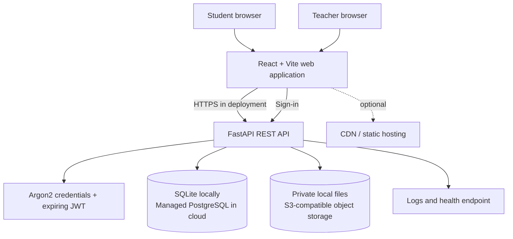

# 👨‍🎓 Cloud-Based Student Assignment Submission & Feedback Portal

A cloud-ready learning workspace for coursework, private file submissions, version history, teacher grading, and student feedback. The repository runs locally with no paid services and can switch to PostgreSQL and private S3-compatible object storage through environment configuration.

## Overview

Students and teachers use the same React application with role-specific screens. FastAPI validates every request and owns the authorization boundary. Assignment and submission metadata live in a relational database; the submitted documents live separately in private object storage. A student can upload new versions, follow submission status, download their own work, and read marks and feedback. A teacher can publish coursework, review submissions for their courses, download student files, and save grades.

## Architecture



### Request and Submission Flow

1. A teacher signs in and publishes an assignment. The API validates the teacher role and course ownership, then writes assignment metadata to SQL.
2. Students load their dashboard through authenticated REST requests. The server returns only permitted coursework and their own submission history.
3. A student selects a file. The API validates role, deadline policy, extension, size, and the PDF signature when applicable.
4. The storage adapter writes file bytes to a generated private object key. The API stores that key, file metadata, version, timestamp, and status in SQL.
5. A teacher downloads a file through an ownership-checked endpoint, then posts marks and written feedback. The student sees the grade on refresh.

## Technology Stack

| Layer | Technology |
|---|---|
| Frontend | React 19, Vite, Lucide icons, responsive CSS |
| API | Python 3.12+, FastAPI, Uvicorn, Pydantic |
| Authentication | Argon2 password hashing, expiring signed JWTs |
| Data | SQLAlchemy; SQLite locally, PostgreSQL through `DATABASE_URL` |
| File storage | Private local directory by default; optional AWS S3 or S3-compatible endpoint |
| Testing | Pytest, FastAPI TestClient, SQLite in-memory test database |
| Delivery | Docker Compose, GitHub Actions CI |

## Features

- Student self-registration; public registration always grants the student role.
- Environment-seeded dummy teacher and student accounts for local demonstration.
- Role-protected teacher and student dashboards.
- Teacher assignment create, update, and delete API; deletion is rejected after submissions exist.
- Assignment deadlines, maximum marks, file type policy, and resubmission policy.
- PDF, DOCX, PNG, JPG, and JPEG upload, configurable maximum file size, private download, and version history.
- Server-generated timestamps and configurable late-submission acceptance.
- Teacher grading and written feedback with maximum-mark validation.
- Idempotency key support to make client retries return the original submission.
- Dashboard metrics, submission search, and deadline overview.
- Health endpoint, Docker Compose, automated backend tests, and CI workflow.

## Cloud Computing Concepts

| Concept | Where it appears |
|---|---|
| SaaS / client-server | Browser UI consumes a shared authenticated API |
| PaaS | Deploy the API container to Cloud Run, App Runner, or Azure Container Apps |
| IaaS | Optional VM deployment; not required by the default topology |
| Cloud database | SQLAlchemy supports a managed PostgreSQL `DATABASE_URL`; SQLite is local-only |
| Object storage | S3 adapter stores private objects independently from relational metadata |
| Authentication / RBAC | Argon2 credentials, JWT verification, role checks, teacher ownership checks |
| REST / API gateway | `/api/*` JSON and multipart endpoints; a managed gateway can sit in front |
| Scalability / elasticity | Stateless API replicas with PostgreSQL and object storage; platform autoscaling is a deployment option |
| CDN / load balancing | Recommended cloud edge for static assets and API ingress; not enabled locally |
| Secrets / environment | Database, token, demo, and S3 configuration supplied through environment variables |
| Logging / monitoring | Structured platform logs and `/api/health`; external metrics and alerts are deployment additions |
| Backup / availability | Managed database backups and object versioning/lifecycle policies should be enabled in the cloud account |
| CI/CD | GitHub Actions runs backend tests and a frontend production build for pushes and pull requests |

## Data and Storage Design

`users` own courses as teachers; `courses` contain assignments; each assignment receives multiple student submission versions. Submission rows contain `storage_path`, filename, size, timestamp, status, marks, and feedback. The file bytes never go into a database binary column. Queries are indexed on user roles, assignment/course ownership, submission student, status, deadline, and timestamps.

## 🏗️ Project Structure

```text
.
├── .github/workflows/ci.yml
├── backend/
│   ├── app/                 # FastAPI routes, models, schemas, security, storage
│   ├── tests/               # API and authorization tests
│   ├── Dockerfile
│   └── requirements.txt
├── docs/
│   └── architecture.md
├── frontend/
│   ├── src/                 # React screens, API client, styles
│   ├── Dockerfile
│   └── nginx.conf
├── docker-compose.yml
├── .env.example
└── README.md
```

## API Overview

All protected routes use `Authorization: Bearer <token>`. The complete interactive OpenAPI reference is served at `/docs`.

| Method | Endpoint | Access | Purpose |
|---|---|---|---|
| POST | `/api/auth/register` | Public | Create a student account |
| POST | `/api/auth/login` | Public | Sign in and receive JWT |
| GET | `/api/auth/me` | Signed in | Current identity |
| POST | `/api/auth/logout` | Signed in | Client session logout acknowledgement |
| GET | `/api/dashboard` | Signed in | Role-scoped summary |
| GET | `/api/courses` | Signed in | Course choices |
| GET / POST | `/api/assignments` | Signed in / teacher | List or create coursework |
| GET / PUT / DELETE | `/api/assignments/{id}` | Signed in / owning teacher | Read, edit, or delete (only before submissions) |
| POST | `/api/assignments/{id}/submit` | Student | Upload a new version; multipart `file` |
| GET | `/api/submissions/me` | Student | Own submission history and grades |
| GET | `/api/assignments/{id}/submissions` | Owning teacher | Review assignment submissions |
| GET | `/api/submissions/{id}/download` | Submission owner / owning teacher | Authorized private download |
| POST | `/api/submissions/{id}/grade` | Owning teacher | Save marks and feedback |
| GET | `/api/health` | Public | Liveness check |

Typical errors are `401` unauthenticated/expired token, `403` wrong role, `404` inaccessible resource, `409` deadline/resubmission conflict, `413` file too large, `415` unsupported file, `422` invalid fields/marks, and `503` temporary storage failure.

## Security Notes and Limitations

- Passwords use Argon2 hashing. JWTs expire; client logout removes the browser token but this MVP does not maintain a server-side token revocation list.
- The API enforces role and ownership checks, private downloads, file extension and size controls, and a PDF signature check. Add malware scanning, rate limiting, stronger MIME/content inspection, audit trails, and security headers before production.
- The browser stores the token in local storage for a simple demo. A production deployment should prefer secure, HttpOnly, SameSite cookies or a carefully designed OIDC flow and add CSRF protections where needed.
- CORS defaults to the configured frontend origin. Production must use HTTPS and an explicit origin.
- The local storage adapter is not shared between replicas. Use S3-compatible storage before horizontal scaling.
- SQL schema creation uses `create_all` for the starter. Use Alembic migrations and managed database backups for a maintained deployment.
- Demo teacher provisioning is environment-based. Replace it with audited administrative provisioning or managed identity integration.


## 📈 Future Improvements

Add course enrollment/rosters, teacher/admin invitation flow, assignment archive UI, signed direct-to-storage uploads, resumable uploads, malware scanning worker, notifications, audit log, rubric grading, token revocation, Alembic migrations, observability metrics, backup drills, and end-to-end browser tests. For 100,000 learners near a deadline, route uploads directly to object storage using short-lived signed URLs, process scans/notifications through queues, scale stateless API instances horizontally, pool database connections, and apply CDN/cache policies to read-heavy static/course data.

## Learning Outcomes

The project demonstrates client-server design, REST APIs, JWT authentication, RBAC, relational modeling, object storage, private file delivery, environment-based configuration, containerization, automated testing, CI, and cloud deployment planning.

## 👨‍💻 Author: 
Shresthaa Maiti
