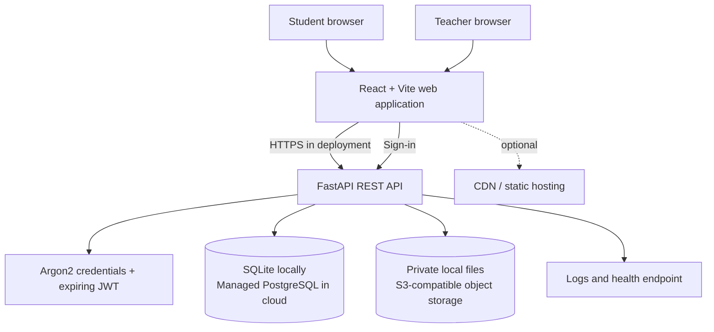

# Cloud-Based Student Assignment Submission & Feedback Portal

A cloud-ready learning workspace for coursework, private file submissions, version history, teacher grading, and student feedback. The repository runs locally with no paid services and can switch to PostgreSQL and private S3-compatible object storage through environment configuration.

> **Project status:** runnable academic MVP. Local authentication, RBAC, assignment workflows, uploads/downloads, grading, dashboards, automated tests, Docker Compose, and CI are included. Cloud deployment targets are documented; this repository does not provision cloud accounts or claim that optional CDN, autoscaling, serverless, or malware-scanning services are already active.

## Overview

Students and teachers use the same React application with role-specific screens. FastAPI validates every request and owns the authorization boundary. Assignment and submission metadata live in a relational database; the submitted documents live separately in private object storage. A student can upload new versions, follow submission status, download their own work, and read marks and feedback. A teacher can publish coursework, review submissions for their courses, download student files, and save grades.

## Architecture



### Request and Submission Flow

1. A teacher signs in and publishes an assignment. The API validates the teacher role and course ownership, then writes assignment metadata to SQL.
2. Students load their dashboard through authenticated REST requests. The server returns only permitted coursework and their own submission history.
3. A student selects a file. The API validates role, deadline policy, extension, size, and the PDF signature when applicable.
4. The storage adapter writes file bytes to a generated private object key. The API stores that key, file metadata, version, timestamp, and status in SQL.
5. A teacher downloads a file through an ownership-checked endpoint, then posts marks and written feedback. The student sees the grade on refresh.

The detailed architecture, entity relationships, trust boundaries, cloud-service mappings, and scaling notes are in [docs/architecture.md](docs/architecture.md).

## Technology Stack

| Layer | Technology |
|---|---|
| Frontend | React 19, Vite, Lucide icons, responsive CSS |
| API | Python 3.12+, FastAPI, Uvicorn, Pydantic |
| Authentication | Argon2 password hashing, expiring signed JWTs |
| Data | SQLAlchemy; SQLite locally, PostgreSQL through `DATABASE_URL` |
| File storage | Private local directory by default; optional AWS S3 or S3-compatible endpoint |
| Testing | Pytest, FastAPI TestClient, SQLite in-memory test database |
| Delivery | Docker Compose, GitHub Actions CI |

## Features

- Student self-registration; public registration always grants the student role.
- Environment-seeded dummy teacher and student accounts for local demonstration.
- Role-protected teacher and student dashboards.
- Teacher assignment create, update, and delete API; deletion is rejected after submissions exist.
- Assignment deadlines, maximum marks, file type policy, and resubmission policy.
- PDF, DOCX, PNG, JPG, and JPEG upload, configurable maximum file size, private download, and version history.
- Server-generated timestamps and configurable late-submission acceptance.
- Teacher grading and written feedback with maximum-mark validation.
- Idempotency key support to make client retries return the original submission.
- Dashboard metrics, submission search, and deadline overview.
- Health endpoint, Docker Compose, automated backend tests, and CI workflow.

## Cloud Computing Concepts

| Concept | Where it appears |
|---|---|
| SaaS / client-server | Browser UI consumes a shared authenticated API |
| PaaS | Deploy the API container to Cloud Run, App Runner, or Azure Container Apps |
| IaaS | Optional VM deployment; not required by the default topology |
| Cloud database | SQLAlchemy supports a managed PostgreSQL `DATABASE_URL`; SQLite is local-only |
| Object storage | S3 adapter stores private objects independently from relational metadata |
| Authentication / RBAC | Argon2 credentials, JWT verification, role checks, teacher ownership checks |
| REST / API gateway | `/api/*` JSON and multipart endpoints; a managed gateway can sit in front |
| Scalability / elasticity | Stateless API replicas with PostgreSQL and object storage; platform autoscaling is a deployment option |
| CDN / load balancing | Recommended cloud edge for static assets and API ingress; not enabled locally |
| Secrets / environment | Database, token, demo, and S3 configuration supplied through environment variables |
| Logging / monitoring | Structured platform logs and `/api/health`; external metrics and alerts are deployment additions |
| Backup / availability | Managed database backups and object versioning/lifecycle policies should be enabled in the cloud account |
| CI/CD | GitHub Actions runs backend tests and a frontend production build for pushes and pull requests |

## Data and Storage Design

`users` own courses as teachers; `courses` contain assignments; each assignment receives multiple student submission versions. Submission rows contain `storage_path`, filename, size, timestamp, status, marks, and feedback. The file bytes never go into a database binary column. Queries are indexed on user roles, assignment/course ownership, submission student, status, deadline, and timestamps.

Object keys follow `submissions/{assignment_id}/{student_id}/{random_id}/{filename}`. Local and S3 implementations keep objects private. The API streams downloads only after checking the authenticated student owns the submission or the teacher owns its assignment.

## Project Structure

```text
.
├── .github/workflows/ci.yml
├── backend/
│   ├── app/                 # FastAPI routes, models, schemas, security, storage
│   ├── tests/               # API and authorization tests
│   ├── Dockerfile
│   └── requirements.txt
├── docs/
│   └── architecture.md
├── frontend/
│   ├── src/                 # React screens, API client, styles
│   ├── Dockerfile
│   └── nginx.conf
├── docker-compose.yml
├── .env.example
└── README.md
```

## Local Setup (Windows PowerShell)

Requirements: Python 3.12 or later, Node.js 22+, and npm. Docker Desktop is optional.

1. Create the local environment file and replace the example secrets/passwords with unique local values:

   ```powershell
   Copy-Item .env.example backend/.env
   ```

   `JWT_SECRET` should be a random value (for example, `python -c "import secrets; print(secrets.token_urlsafe(48))"`). Keep `.env` out of Git.

2. Install backend dependencies and start the API:

   ```powershell
   python -m venv .venv
   .\.venv\Scripts\Activate.ps1
   python -m pip install -r backend/requirements.txt
   Set-Location backend
   python -m uvicorn app.main:app --reload --port 8000
   ```

   The API is at `http://127.0.0.1:8000`; interactive docs are at `http://127.0.0.1:8000/docs`.

3. In a second terminal, install frontend dependencies and start Vite:

   ```powershell
   Set-Location frontend
   npm install
   node .\node_modules\vite\bin\vite.js --host 127.0.0.1
   ```

   Open `http://127.0.0.1:5173`. The workspace folder name contains `&`; on Windows that can confuse npm's default `cmd.exe` script launcher. Invoking the Vite CLI with Node, as above, avoids that shell parsing issue. In a path without `&`, `npm run dev` works normally.

4. The first API start creates the schema and dummy data if both demo passwords are configured and the database is empty. Sign in using the emails/passwords in `backend/.env` (`DEMO_TEACHER_*` and `DEMO_STUDENT_*`). New users can register from the sign-in page as students.

5. Sign in as teacher, create an assignment, then sign in as student in a private/incognito browser window, submit a PDF, and return to the teacher account to download and grade it. The default files are under `backend/private_uploads`; metadata is in `backend/portal.db`.

> Seed identities are local demo data only. Do not deploy the example passwords or permit open teacher registration in a real institution.

## Run with Docker Compose

Docker Compose runs PostgreSQL, the API, and the static frontend. Copy the root environment template to both locations (the API reads its own `.env`; Compose reads root `.env`):

```powershell
Copy-Item .env.example .env
Copy-Item .env.example backend/.env
docker compose up --build
```

Set a unique `POSTGRES_PASSWORD` and `JWT_SECRET` in both files first. Visit `http://localhost:8080`; API docs remain at `http://localhost:8000/docs`. Named volumes persist PostgreSQL data and uploaded files. Stop with `docker compose down`; add `-v` only if you intentionally want to delete the local demo data.

## Environment Variables

See [.env.example](.env.example). Key settings are `DATABASE_URL`, `JWT_SECRET`, `JWT_EXPIRE_MINUTES`, `FRONTEND_ORIGIN`, `MAX_UPLOAD_MB`, `ALLOW_LATE_SUBMISSIONS`, `STORAGE_BACKEND`, demo identity values, and optional S3 fields. `DATABASE_URL` can target PostgreSQL with the `postgresql+psycopg://` scheme. Set `STORAGE_BACKEND=s3`, `S3_BUCKET`, and `AWS_REGION` for S3; use workload identity/IAM in hosted environments instead of long-lived access keys.

## API Overview

All protected routes use `Authorization: Bearer <token>`. The complete interactive OpenAPI reference is served at `/docs`.

| Method | Endpoint | Access | Purpose |
|---|---|---|---|
| POST | `/api/auth/register` | Public | Create a student account |
| POST | `/api/auth/login` | Public | Sign in and receive JWT |
| GET | `/api/auth/me` | Signed in | Current identity |
| POST | `/api/auth/logout` | Signed in | Client session logout acknowledgement |
| GET | `/api/dashboard` | Signed in | Role-scoped summary |
| GET | `/api/courses` | Signed in | Course choices |
| GET / POST | `/api/assignments` | Signed in / teacher | List or create coursework |
| GET / PUT / DELETE | `/api/assignments/{id}` | Signed in / owning teacher | Read, edit, or delete (only before submissions) |
| POST | `/api/assignments/{id}/submit` | Student | Upload a new version; multipart `file` |
| GET | `/api/submissions/me` | Student | Own submission history and grades |
| GET | `/api/assignments/{id}/submissions` | Owning teacher | Review assignment submissions |
| GET | `/api/submissions/{id}/download` | Submission owner / owning teacher | Authorized private download |
| POST | `/api/submissions/{id}/grade` | Owning teacher | Save marks and feedback |
| GET | `/api/health` | Public | Liveness check |

Typical errors are `401` unauthenticated/expired token, `403` wrong role, `404` inaccessible resource, `409` deadline/resubmission conflict, `413` file too large, `415` unsupported file, `422` invalid fields/marks, and `503` temporary storage failure.

## Security Notes and Limitations

- Passwords use Argon2 hashing. JWTs expire; client logout removes the browser token but this MVP does not maintain a server-side token revocation list.
- The API enforces role and ownership checks, private downloads, file extension and size controls, and a PDF signature check. Add malware scanning, rate limiting, stronger MIME/content inspection, audit trails, and security headers before production.
- The browser stores the token in local storage for a simple demo. A production deployment should prefer secure, HttpOnly, SameSite cookies or a carefully designed OIDC flow and add CSRF protections where needed.
- CORS defaults to the configured frontend origin. Production must use HTTPS and an explicit origin.
- The local storage adapter is not shared between replicas. Use S3-compatible storage before horizontal scaling.
- SQL schema creation uses `create_all` for the starter. Use Alembic migrations and managed database backups for a maintained deployment.
- Demo teacher provisioning is environment-based. Replace it with audited administrative provisioning or managed identity integration.

## Cloud Deployment Architecture

Recommended student deployment: static frontend hosting (Firebase Hosting, Cloudflare Pages, or S3/CloudFront), a containerized FastAPI API (Cloud Run/App Runner/Azure Container Apps), managed PostgreSQL (Neon/Supabase/AWS RDS), and private S3-compatible object storage. Configure `VITE_API_URL` at frontend build time; set `DATABASE_URL`, `JWT_SECRET`, CORS origin, and storage settings in the API platform's secret manager.

For AWS, map static assets to S3 + CloudFront, API to App Runner or ECS/Fargate behind API Gateway/ALB, database to RDS PostgreSQL, files to a private S3 bucket, identity to the included API auth or Cognito integration, and logs to CloudWatch. Azure equivalents include Static Web Apps/CDN, Container Apps, Azure Database for PostgreSQL, Blob Storage, Entra External ID, and Azure Monitor. Google Cloud equivalents include Firebase Hosting/Cloud CDN, Cloud Run, Cloud SQL, Cloud Storage, Identity Platform, and Cloud Logging.

Use TLS, managed secrets, least-privilege workload identities, database backups, bucket versioning/lifecycle policy, health checks, and deployment approvals. Current repo deployment files provide local Docker Compose only; a real cloud deployment also needs account-specific provisioning and secrets.

## Tests and GitHub CI

Run tests and builds:

```powershell
Set-Location backend
python -m pytest -q
Set-Location ..\frontend
npm ci
node .\node_modules\vite\bin\vite.js build
```

The backend suite checks registration role safety, authorization, upload policy, download privacy, idempotency, and grading validation. [docs/architecture.md](docs/architecture.md) explains the request paths; use `/docs` for interactive API testing. GitHub Actions runs the API tests and frontend production build on pushes and pull requests.

## Demo and Proof Checklist

Capture screenshots in a `screenshots/` directory if you add one to the repository:

| Filename | Evidence |
|---|---|
| `01-login.png` | Branded sign-in and registration |
| `02-teacher-dashboard.png` | Faculty metrics and deadlines |
| `03-assignment-published.png` | Assignment list and publish form |
| `04-student-dashboard.png` | Student coursework and pending counts |
| `05-submission-upload.png` | Selected file and successful confirmation |
| `06-private-storage.png` | Local private file or cloud bucket object |
| `07-submission-record.png` | SQL metadata and generated object key |
| `08-teacher-review.png` | Submission, grade, and feedback controls |
| `09-student-feedback.png` | Student-visible marks and feedback |
| `10-authorization-test.png` | API denial for the wrong role/owner |
| `11-api-docs.png` | OpenAPI endpoint documentation |
| `12-ci-tests.png` | Passing GitHub Actions run |
| `13-deployment.png` | Hosting/API/database resources after deployment |

Keep screenshots free of real personal data, tokens, and credentials. Suggested commit sequence: `Initialize portal structure`, `Add authentication and role boundaries`, `Implement assignment and submission API`, `Add cloud storage adapter`, `Build student and teacher workflows`, `Add tests and CI`, `Document architecture and deployment`.

## Future Improvements

Add course enrollment/rosters, teacher/admin invitation flow, assignment archive UI, signed direct-to-storage uploads, resumable uploads, malware scanning worker, notifications, audit log, rubric grading, token revocation, Alembic migrations, observability metrics, backup drills, and end-to-end browser tests. For 100,000 learners near a deadline, route uploads directly to object storage using short-lived signed URLs, process scans/notifications through queues, scale stateless API instances horizontally, pool database connections, and apply CDN/cache policies to read-heavy static/course data.

## Learning Outcomes

The project demonstrates client-server design, REST APIs, JWT authentication, RBAC, relational modeling, object storage, private file delivery, environment-based configuration, containerization, automated testing, CI, and cloud deployment planning.