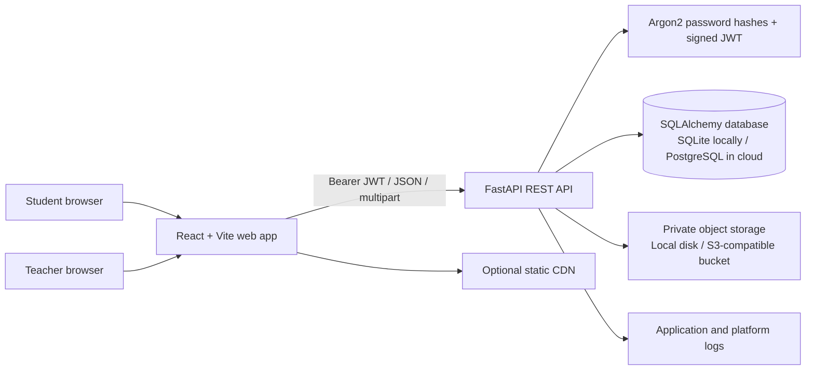
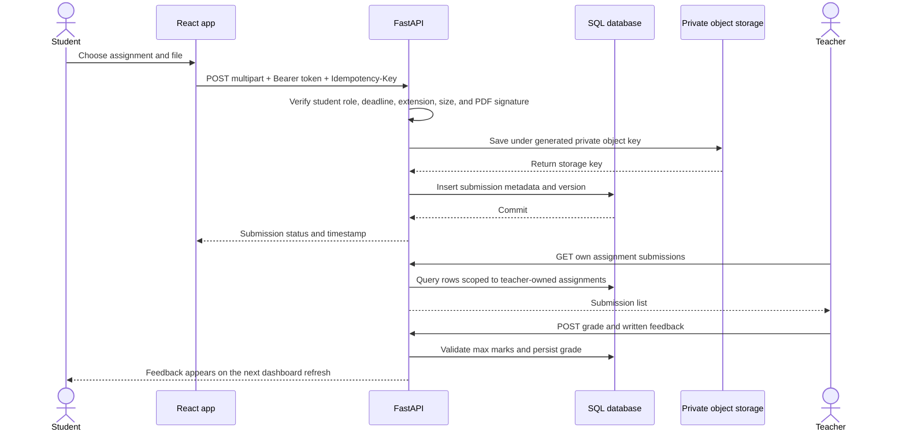
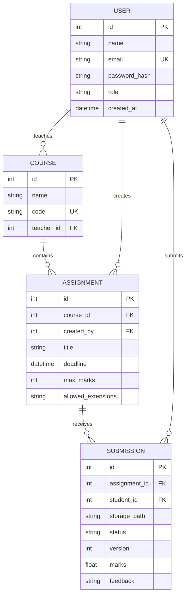

# System Architecture

## Runtime View

The browser never receives a public file URL. It requests a download from the API; the API checks the caller's role and ownership, reads the private object, and streams it back. This keeps authorization at one auditable boundary.

## Submission Sequence

## Data Model

Indexes are placed on assignment ownership, course, student, status, deadline, and submission time to keep the dashboard and teacher review filters selective. Binary file contents are not stored in SQL; rows contain metadata and an opaque object key only.

## Trust Boundaries

- Authentication is performed by the API. Passwords are Argon2-hashed; API tokens are signed JWTs with expiration.
- Public registration always creates a student. Teacher accounts are seeded from environment variables for the local demo; production teacher provisioning must be restricted to an administrator or an identity provider.
- Assignment ownership is checked for teacher reads, edits, and grading. Student submission reads and downloads are scoped to the authenticated student.
- Files are private by default in both storage modes. Local files are not exposed by the frontend server; S3 objects are written without public ACLs.
- The API validates extensions, configured size limit, non-empty content, and PDF signature. Production systems should add malware scanning, stronger content sniffing, and audit events.

## Cloud Mapping

| Concern | Local/demo implementation | Cloud deployment mapping |
|---|---|---|
| Web UI | Vite development server or Nginx container | Static hosting + CDN (S3/CloudFront, Azure Static Web Apps, Firebase Hosting) |
| API | FastAPI/Uvicorn | Cloud Run, App Runner, Azure Container Apps, or a VM |
| Relational data | SQLite file | Managed PostgreSQL (RDS, Cloud SQL, Azure Database for PostgreSQL) |
| Submission files | Private local directory | Private S3-compatible bucket; use workload identity/role credentials |
| Authentication | API-managed Argon2 password hashes and JWT | Hosted API remains valid; alternatively integrate Cognito, Firebase Auth, or Supabase Auth and verify provider tokens |
| TLS / edge | Local HTTP only | HTTPS load balancer or platform ingress; optional CDN for static assets |
| Monitoring | Uvicorn/platform stdout logs | CloudWatch, Cloud Logging, or Azure Monitor; add metrics, alerting, and trace correlation |
| CI/CD | GitHub Actions builds/tests | Add image publishing and deployment after environment secrets and approvals are configured |

## Cloud Scaling Notes

The application container is stateless except for the explicitly selected local SQLite/file mode. For horizontal replicas, configure PostgreSQL and S3, keep JWT secrets consistent across instances using a secrets manager, and do not use local files. For deadline bursts, use resumable/direct-to-object-storage uploads with short-lived signed upload URLs, a queue for malware scanning/notifications, a CDN for static assets, database connection pooling, and autoscaling API workers. Those advanced services are architecture guidance, not claims that the starter deploys them automatically.